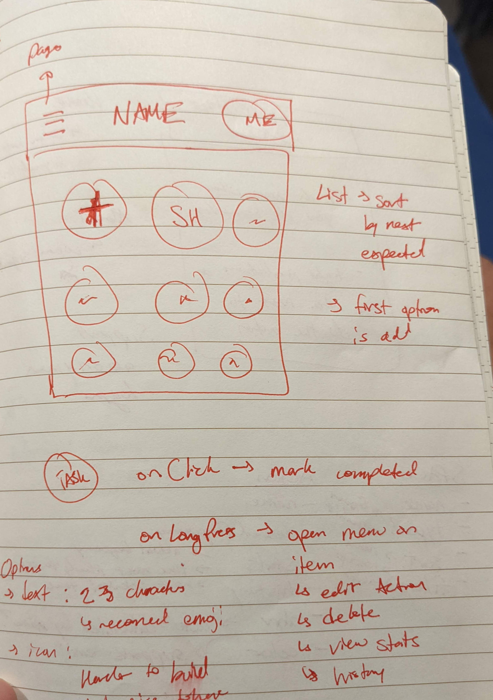

# when did i

## desired features
- keep track of when I last did certain actions
- build routine/checklist based on some of these actions
- organize actions into spaces
- show history on actions
- show stats, graphs, charts on history
- offer predictions based on history

## milestones
- [ ] proof of concept
  - show list of actions (w/o nav bar)
  
- [ ] data: localStorage
  - CRUD actions
  - make actions do stuff
    - onClick: mark action is done at time of click
- [ ] auth: firebase auth
  - build nav bar
  - add auth
- [ ] data: firebase database
- more!?